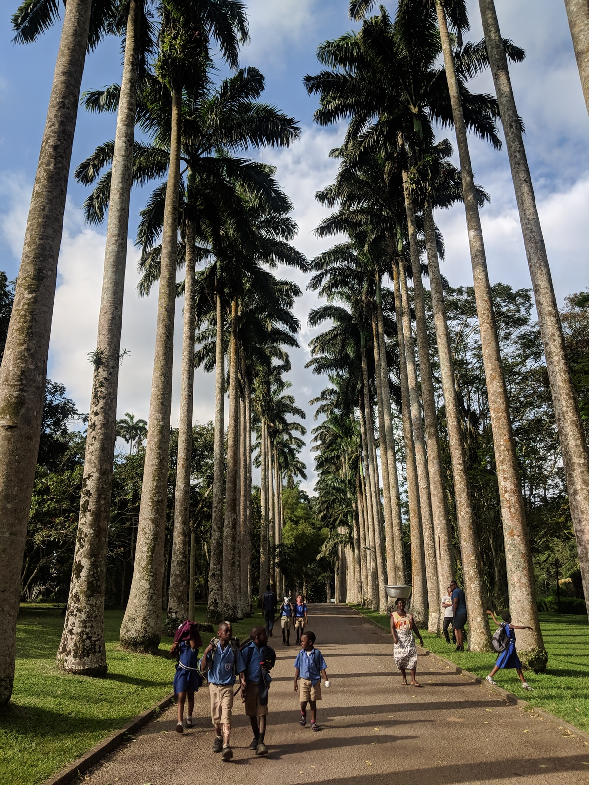

It was a Saturday morning.

My dad’s neighbour had invited my friend and I round for a chat and a customary Ghanaian brunch of Fried Yam and Egg Stew.

As we sat and conversed, I found myself falling out of it. Not out of boredom, but down to my own rudeness. I had got myself caught in the social sapping hole that is Instagram.

I was about to upload a picture that I’d taken when visiting Aburi Botanical Gardens just a few days earlier. It was idyllic, and perfectly captured the beauty and uniqueness of the swaying palm trees as locals got on with their daily lives.

“Elite School Run” I captured it as I slyly grinned to myself, partially doing so to show interest and thought in a conversation that I had long since logged out of.

I got over the pre-post anxiety of IG, and put my phone away as soon as I posted. Half excited about the incoming likes and comments, and half nervous that people would think I was trying too hard. Social media for you.

I tuned and subsequently chimed back into an interesting conversation about mental health in Ghanaian communities. Feeling a bit ashamed that I had spent so much time pondering on something so superficial, when an interesting and important conversation was taking place right before my eyes.

Time had passed, and I checked my notifications, impressed by the swathes of likes and comments that I had consciously craved. Yet, one in particular caught my attention.

“You’re finally home”, a Ghanaian acquaintance from University posted with love hearts.

That’s nice I thought, I told myself as I became slightly irked and bemused by this throwaway comment. I remember thinking, ‘what does he mean by home?’, and better yet, ‘what does he mean by finally?

I always thought the guy was cool but he didn’t really know me like that. The comment was intrusive and lacking in context, but there was some truth to it.

The last time I’d set foot on Ghanaian soil was the summer of 2008, I had just finished my GCSEs and all I wanted to do was galivant around the ends with my friends before we went to 6th Form that Autumn. My parents were having none of that, and saw it fit I went on a family trip to Ghana, with my aunt and cousins before my mum and sister joined up with us at a later date.

I was there for what felt like the whole of the summer. I was abrasive, insolent and wanting to do my own thing, which was watch TV and play GTA all day. I’d come to see family holidays back home as a chore that involved being ferried around various family homes, to see relatives I barely knew or cared for. Luckily I had my older cousin, who was happy to let me tag along with his friends and get a different perspective on Ghana than I had previously seen. I was barely in tune with it, but I welcomed the difference and freedom it brought.

Fast forward 10 years and I was back in the country of my own volition. My close friend, and fellow Ghanaian had employed some sort of soft power, Jedi mind trick tactics to finally get me to book my ticket.

“Bros if I asked you to go to Colombia, or any of these South American countries you’d jump at the chance, but your own country of origin of Ghana, you can’t follow me to?”, he said assertively on the phone as I gave him excuse after excuse as to why I wasn’t on going.

That was the straw that broke the camel’s back, and I ended booking my ticket as we ended the call. Three months and about 7 hours later to be exact, I was getting off the plane at Kotaka airport, hit by an initial gust of humid hot air as I tried to make sense of the almost instantaneous hustle and bustle I was met with.

I’m afraid it didn’t get much better after that. Clearly drowsy, by a half and uncomfortable sleep on the flight, I’d forgotten the small oversight I made in asking not one, but three family members to pick me up from the airport. All of whom added to the furore of craziness that confused me even further. Boy was this about to be some trip

Whilst my flights were booked in about 3 clicks, I’d thought long and hard about what it was going to be like to be back. I talk of an indifferent experience in the country in 2008, but in doing so I gloss over many a magical experience I had before then, spending my summers running around with my cousins. I can think back to the summer of 2004, where I flew to Accra alone, spending the whole summer at the compound of my mum’s great aunt in the working class district of Mamprobi.

Such vivid memory for two main reasons.

Firstly, I went there with my prized possession, a SONY Walkman, and with that only one CD… Kanye West’s College Dropout, which till this day I still know every single word to. I’ll never let you down Ye.

Secondly, my parents not wanting me to fall behind with my education (it was the holidays!!), got me a French tutor whilst I was out there. So at 5pm, Monday to Friday I would sit on my Great Aunt’s front porch and practice enunciation with this Togolese man, as I could hear my cousins and their friends running riot, playing games of "small post" football at the back of the house or at the grounds of the local state school, often being chased away by the older kids.

I hated it when I first got there, But I was in tears when I left.

I thought back to 1998, and then again to 2006, when I went with my Dad and had to deal with somebody trying to defraud us, not before mentioning an overbooked flight back home, which meant we were delayed and as a result, missed the first day of the Nottinghill Carnival. I was vex!

The constant in all these experiences, both good and bad was the feeling of community that was brought on by the frequency, and subsequently the familiarity I had with the country. Having family members at both ends of the spectrum of wealth, meant I’d always been seen both perspectives on what life was like in the country. I wondered how it had changed, and how that would impact my experience out there.

My biggest worry about going back was the homecoming aspect of it. I kind of felt like the prodigal son, but more prodigal than son. In youth, I formed special bonds with family members who I simply didn’t have the privilege of seeing unless I went to Ghana.

Some of those people had passed, and I never got or wanted to say goodbye. It was very much an out of sight, out of mind thing, and as these things became clearer and clearer in my rear-view, I got nervous.

Even though I’d gone with friends I knew I’d have to see family, rebuild past relationships and formulate new ones with people I’d met in passing but by blood was connected too, like the children of my uncle, who in turn had actually spent some time with us in London. If anything, he was my lynchpin; the guy who I felt fully myself with, the guy who would advise me how to approach family matters and most importantly, the guy I could just laugh with, about anything and everything.

It didn’t even take two days for me to be thrown back in at the deep end. An elder had died a few months earlier (Ghanaian burials – a story for another time) and his funeral occurred when I was in town. Contrary to my initial thoughts about Ghanaians and their inability to keep time, my uncle’s request to meet him at 11am, really meant 11am and not 1pm as I had planned in my head.

After a night of partying at Carbon, one of the cities swanky new nightclubs that had opened in my absence, I was far too hungover to be anxious about what was to occur. As I walked through and reacquainted myself with the typical theatrical nature of Ghanaian funerals. I spotted my aunts from a distance dancing, celebrating life as we do when someone passes. As I approached, and my rosy cheek filled face became more and more familiar, her jaw dropped, she smiled and then let out the biggest of laughs. We hugged, we laughed and then, she let out a small cry.

‘Aunty Vida should be here’ she said as her voice cracked.

Oh Aunty Vida, Her mum, my mum’s aunt, and the only Grandmother I’d ever had. It was her compound I resided in on my solo trip to Ghana. She’d passed the year prior, 5 years after her husband, my uncle Ray had passed. Both were sad yet fleeting moments, that I was able to contain through the transience that distance brings. I never went to their funerals, the first I didn’t even have the money to go and the second, well I felt it would be wrong of me to fly across the world to mourn someone who I rarely made time for when they were alive – especially in adulthood.

That embrace felt as strong as ever. We felt happier for a lot longer than we felt sad. Pent up thoughts about being an outsider in a place that had always provided a home for me were futile when I came face to face with some of my nearest dearest, no matter how much time had passed.

With family comes a range of emotions, some good and some bad but above all familiar. I got reacquainted fast, and made meaningful bonds with members I had barely known. Some of it was overwhelming, some of it was funny, some of it was annoying but ultimately only sentiments I could only really hold for something I cared for, and that cared for me.

Home is where the heart is. Not in some idyllic backdrop in a botanical garden – but in the people, places and the moments that make you feel present, still and welcomed. It’s not tangible, it’s fleeting but it’s a feeling.

In returning to Ghana, I felt a degree of contentment like no other. Not in reminiscing the fun I had with friends as I experienced the country for the first time as a fully-fledged adult.

But in knowing that there was another place in the world

You can’t return to a feeling.

